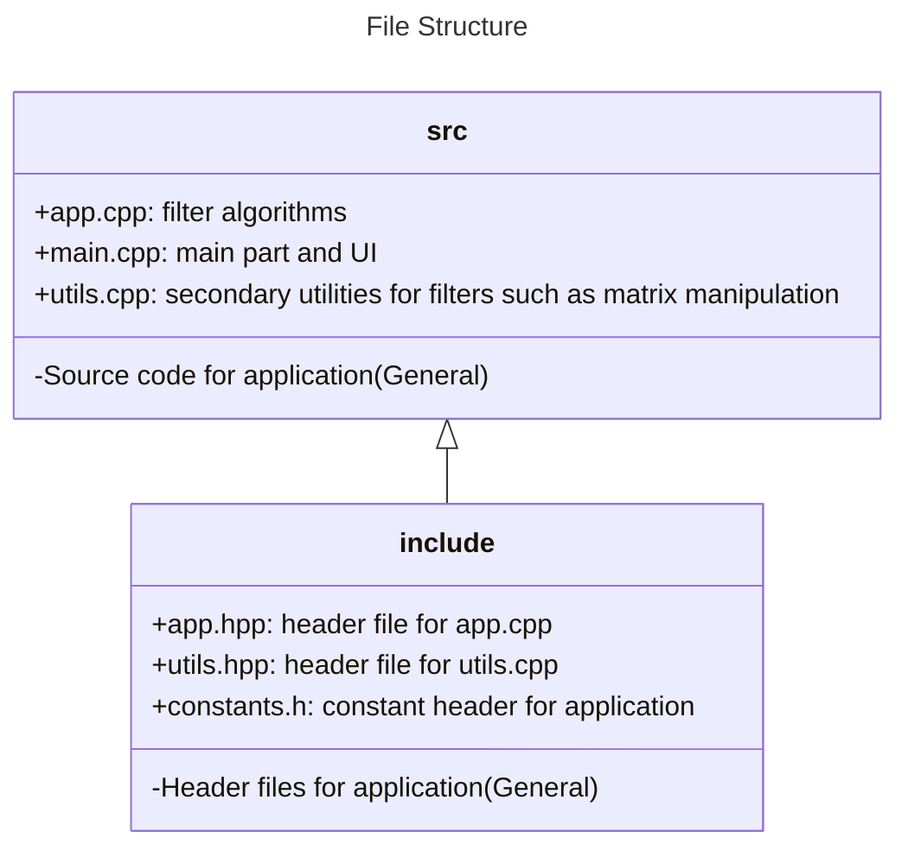

# Developer Documentation

This document provides a concise introduction to the concept of filters in image processing and the OpenCV framework. It also includes an explanation of the algorithms and detailed descriptions of the filters used in this project.

## Table of Contents

- [Developer Documentation](#developer-documentation)
  - [Table of Contents](#table-of-contents)
  - [What is a Filter](#what-is-a-filter)
  - [What is OpenCV](#what-is-opencv)
  - [Smoothing](#smoothing)
    - [Gaussian Blur](#gaussian-blur)
      - [Code Choices](#code-choices)
  - [References](#references)

## What is a Filter  

A filter is a device or process that removes unwanted components or features from something. However in the image processing filter (also called a mask or kernel) means a mathematical operation applied to modify or enhance an image. Filters are typically small matrices that are convolved with the original image to produce a new, processed image.  
In mathematical terms:  

```Text  
g(x,y) = ∑∑ h(i,j) × f(x-i, y-j)
```

Where `g(x,y)` is the filtered image and `f(x,y)` is original image and the `h(i,j)` is the filter kernel. 

## What is OpenCV

From the openCV [website](https://opencv.org/) OpenCV is the world's biggest computer vision library. OpenCV is open source, contains over 2500 algorithms, and is operated by the non-profit Open Source Vision Foundation. In a nutshell it is an open source computer vision framework that supports multiple programming languages. For further explanation please visit [official documentation](https://docs.opencv.org/).  

## Smoothing  

Smoothing  is a simple and frequently used image processing operation. It removes noise and unnecessary details by removing high frequency components of the image because the real world imagery is inherently imperfect. Therefore, most of the computer vision algorithms used smoothing in their pre-processes. One of the most common smoothing techniques are implemented in this project. It is good to note that smoothing sometimes called blurring they are essentially same^[1].

### Gaussian Blur

Gaussian blurring or Gaussian blur is a process that used to smooth images by applying a function based on Gaussian distribution. It is done by convolving a kernel. The mathematical formula for convolution is:  

```latex
$$
(f * g)[n] = \sum_{k=-\infty}^{\infty} f[k] \cdot g[n-k]
$$
```  

and the mathematical formula for the Gaussian function `f(x,y)` is:  

```latex
$$
f(x, y) = A \cdot e^{-\frac{(x-x_0)^2}{2\sigma_x^2} - \frac{(y-y_0)^2}{2\sigma_y^2}}
$$
```  

#### Code Choices  

The reason why the code is decided to be in that structure will be discussed in this part of the documentation and in all other filter descriptions will have this part. In order to discuss the way first the over all structure must be given and some of the topics must be discussed.



## References

[1] Learning OpenCV by Gary Bradski, [O'Reilly](https://www.oreilly.com/library/view/learning-opencv/9780596516130/ch05s02.html)